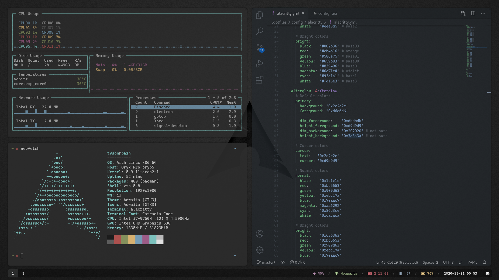

# Preview

# Install

These dotfiles are managed with [rcm](https://github.com/thoughtbot/rcm).

1. Install [rcm](https://github.com/thoughtbot/rcm)
2. Clone dotfiles repo
3. Create symlinks

_Note:_ This repository uses custom hooks to exclude some files from being handled by rcm.  These hooks only apply when the `rcup` command is run so the output from `lsrc` may have additional entries that are not symlinked into the user's home directory.

# Programs
| Program           | Name                  |
| ----------------- | --------------------- |
| Window Manager    | i3-gaps               |
| Compositor        | picom-rounded-corners |
| Bar               | polybar               |
| Program Launcher  | rofi                  |
| Wallpaper Setter  | feh                   |
| Terminal Emulator | alacritty             |
| Shell             | zsh                   |
| Dotfiles          | rcm                   |
